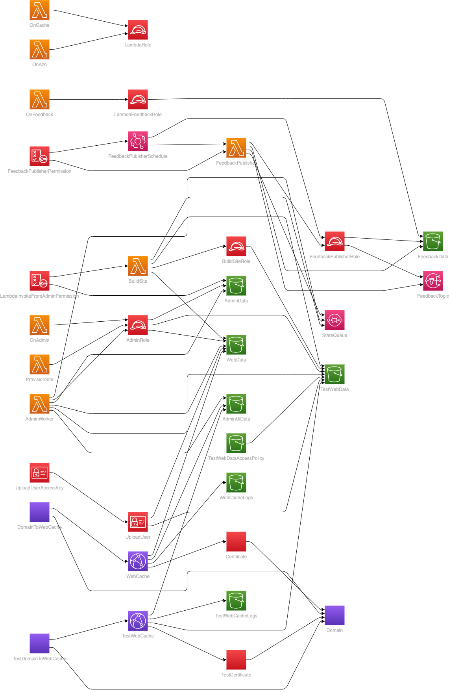

# Static Website Template

If you are looking to build an author website with low hosting cost, 100% under your control, and with no significant limits on data size or bandwidth, you are welcome use this template with your own AWS account. This template is free for use, disributed under the Open Source Apache License 2.0.

The goal of this project is to allow authors to create low-cost, low-maintenance author websites to showcase your work, and provide a basic point of contact with readers. Some technical experience is required in the intial setup, mainly in creating a domain in AWS, and editing/uploading configuration files for the site.

For those who are very much on the non-techie end of the spectrum, I would suggest borrowing a techie friend for a couple of hours to do the initial configuration. After that, ongoing maintenance will be simple.

## Overview

This template creates all the infrastructure necessary to host a mostly static website from an S3 bucket, with the following enhancements:

- Cloaking of .html extensions on page urls.
- Custom 404 page (returns to index.html).
- Built-in target for feeback email forms.
- Built-in forwarder to the Amazon store for the user's country.
- Websites can be generated from eisting templates, or existing files uploaded to the site.
- Website files are generated to a test site first, automatically promoted to the live site with one button click.
- Creates a unique key pair for uploading files to only this website's test site bucket.

## AWS Amplify

This static site service fills a simillar role to using AWS Amplify, but with less $/GB for data transfer. there's also less chance of obscelescence and maintenance due to shifting AWS priorities since it works directly with AWS core building blocks. If you are planning to use your own website/generator code (Not the default author or artist site templates provided), and are comfortable with git and build pipelines, then you may want to check out AWS Amplify instead of this service.

## Required to start

 - Sign up for an [Amazon Web Services Account](https://aws.amazon.com/free).

## Required for full functionality

 - A domain registered in AWS Route53. You can register a new domain, or transfer in an existing domain registration.

## Costs

For each top-level domain hosted with AWS, they will charge you 0.50 USD/month. For the kind of traffic that most author websites see, this will be the main cost for your site. My sites generally cost only a few extra USD cents/month.

You can create multiple sites with this template on subdomains (ie. series1.authordomain.com, series2.authordomain.com), but you will need to register at least one top-level domain.

If you see a huge amount of traffic, or are storing a large amoount of data in the site's S3 bucket, you may see some extra charges. It's always a good idea to keep an eye on your [current and projected billing](https://console.aws.amazon.com/billing/home).

## Building your site

Log in to your AWS Console account, then click on this link from the same browser: [BraeVitae Static Website Template](https://us-east-1.console.aws.amazon.com/cloudformation/home?region=us-east-1#/stacks/create/review?templateURL=https://braevitae-pub.s3.amazonaws.com/AutoSite/AuthorSite.template)

This should open a page in the AWS Cloud Formation service showing the BraeVitae Static Website Template.

The template requires a few data values to be entered:

**DomainName**: The URL for this site. It must be one of the existing hosted domains in your acount, or a subdomain of one of them.

**DomainZoneId**: If the domain entered above is a subdomain of an existing domain, enter the Hosted Zone ID of the parent domain here. This value can be found in the Route53 service by clicking on the hosted zone and opening the Hosted Zone Details section. Leaving this field blank will create a new top-level domain registration in your AWS account, which will cost USD $0.50.

**FeedbackEmail**: The email address where you would like to receive feedback emails from this site. When you build the stack this address will recieve a registration confirmation email that you will need to respond to in order for feedback emails to be sent.

**SiteGenerator**: This field determines the generator that will be used to create your website code. Only one generator is currenlly provided: 'braevitae-pub:AutoSite/lambdas/authorsite.zip', but you can also supply the bucket and path to your own generator function. If you want to upload your own raw content to the site (perhaps created with tools lke [HUGO](https://gohugo.io/) or [Jekyll](https://jekyllrb.com/)), just enter the default value above and directly upload your own content to the test bucket.

## Administration UI

Once the AWS Cloud Formation stack has been sucessfully build, open: https://{your domain}/admin/index

This page allows you to perform some simple administration functions for your website:

### Choose a site template:

This dropdown allows you to select the default set of inital configuration files that will be loaded into your site. This selection is usually made just once for a stack, since changing it will delete all your existing configuration files.

To see an example site, based on the default configuration values, you can click generate now, but you may want to skip to the 'editing your site config' section below.

### Generate:

Click this button to generate content to your test site: https://test.{your domain}/

You can visit this 'test site' path to verify what was generated.

You can re-generate as often as you like (though be aware that there is some cost - generally a fraction of a cent, but it can add up.)

### Publish:

Click this button to replicate your test side to the public site: https://{your domain}/

Warning: This will _replace_ all files on your current public site, and there is currently no way to roll back (undo) the operation, so please review your test site carefully!

## Editing Your Site Config

For now, the admin UI will not help you with editing your website configuration (It's a work in progress).

To change your site configuration, go to the S3 service in your AWS Account console. Open the '{your domain}-admin' bucket, and click on the 'site-config' folder, then the folder with the same name as the template you applied from the admin UI.

Here you will find a collection of configuration files that feed the generator applicaton that you selected when creating this website stack. These files are customized based on the template you applied from the admin UI, or may be entirely absent if you have not prepared a template.

### Author Site Template Configuration

**conf.json:** Core site configuration. Default text that appears on the site. Author names that may be referenced by books, distributors where books might be sold, etc.

**published.json:** Configuration that defines the books that show up on the site (Can include published and not-yet-published books)

**news.json:** Content that appears on the 'news' (blog) page of the site.

**structure.json:** Advanced configuration with low level details that control the way the site renders - Fonts, colours, reflow, etc. Generally you won't want to edit this configuration unless you want to dive in to changing the look of the site.

## Features

### Email Feeback Form

A great feature for any website, but expecially an author, is to give people an easy way to reach you with comments that does not depend on any one social media acount or email address (and does not require you to publish those account detials on the public site!).

The template will ask you for an email address, and shortly after running the template, this address will receive an email from Amazon AWS asking to confirm your subscription with the Simple Notification Service (SNS). You will need to click on the confim link to activate feedback.

To take advantage of this feature, you will need to include a form on your website, and HTTP POST the data to /feedback/*  (Where * is a name that identifies this form wihin this website.)

### Localized Amazon Store

A challenge for book publishers and buyers wanting to send customers to Amazon stores, is that Amazon uses distinct sites for different countries and regions. It's agravating for customers to have to navigate out of the store you sent them to, and search again for your book in their country's storefront. To ensure they don't lose interest before buying, it's much better to send them to the correct store to begin with.

There are a few other services on the internet that do the same thing for free, but it's much better to have these links under your own control, and branded to your own domain name.

To take advantage of this feature, create a link on a page on your site to /azn/e/{ASIN code} for Kindle and /azn/p/{ISBN-10 code} for print books. Both these codes can be foind on the Amazon store pages for your books.

### HTTPS support, and cloaking of .html extensions

AWS provides some built-in features to serve files from S3 buckets to browsers, but this lacks the professional touch. Would you rather send your readers to http://my.domain.com/promotion.html or https://my.domain.com/promotion. A subtle difference, perhaps, but one that stands out. Especially on a poster or business card.

### Show home page instead of error for missing pages

One thing you hate your potential reader to see is an ugly error page instead of your site. It's easy for a mistake to creep into a URL link, or for a page to be moved. In these cases, we'll simply redirect the reader back to the main home page of your site (index.html) so the at least get close to the right place.

### Unique access key for uploading files

It is posisble to upload files directly wih the AWS S3 console to the bucket with the same name as your site's test domain, as described above, but for a large site, it's much, much easier to use a syncing tool like the [AWS CLI](https://docs.aws.amazon.com/cli/latest/userguide/cli-services-s3-commands.html) or others. But to do this, you'll need to provide an access key pair for your site's S3 bucket. These keys are provided on the 'outputs' tab of this cloud Formation stack once it completes.

## Deleting The Site from AWS

If you try out this template, then decide you don't want it any more, you can easily delete all the infrastructure created in your AWS account by deleting the Cloud Formation stack this template created.

But, there are a couple of twists to the process required by AWS:

### Delete all files from the site's S3 buckets:

The stack should delete all files from all buckets it created during the delete process, but sometimes this fails for the access logs buckets:
- {domain name}-logs
- test-{domain name}-logs
And their files will need to be enptied before the stack delete can regres.

### Temporary Failure deleting Lambda functions

The first attempt to delete the stack will likely fail, since AWS holds on to Lambda functions that have been part of a Lambda@Edge, even though the @Edge regisration has been deleted already. When this happens, simply wait about an hour and delete the stack again. It should succeed this time.

### Diagram of the Stack

(Some resources exlcluded for clarity)

