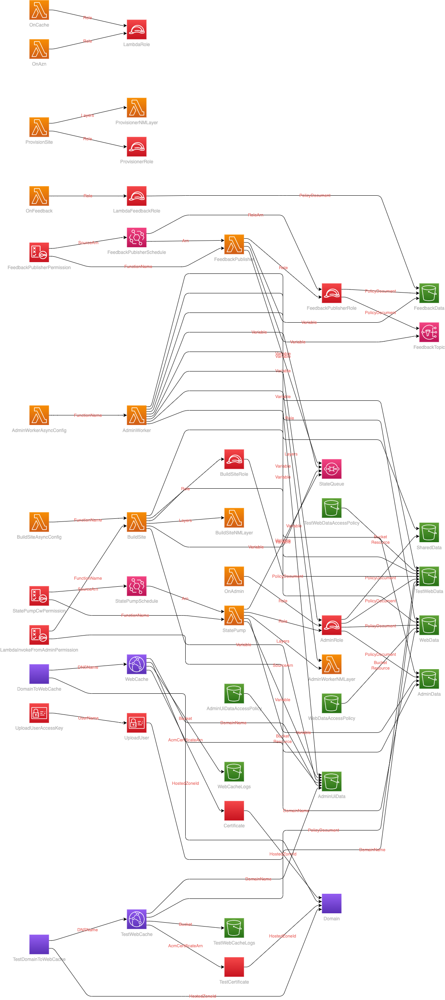

# Static Website Template

If you are looking to build an author website with low hosting cost, 100% under your control, and with no significant limits on data size or bandwidth, you are welcome use this template with your own AWS account.

[BraeVitae Static Website Template](https://us-east-1.console.aws.amazon.com/cloudformation/home?region=us-east-1#/stacks/create/review?templateURL=https://braevitae-pub.s3.amazonaws.com/cloudformation/AuthorSite.template)

This template is free for use, disributed under the Open Source Apache License 2.0.

## Overview

This template creates all the infrastructure necessary to host a mostly static website from an S3 bucket, with the following enhancements:

- Built-in target for email feeback forms.
- Built-in forwarder to the Amazon store for the user's country.
- HTTPS support, and Cloaking of .html extensions on page urls.
- Custom 'page not found' handling.
- Creates a unique access key pair for uploading files to only this website's bucket.

What this template does NOT do, is provide any website code. You will need to upload the html files and images that describe your website (perhaps created with tools lke [HUGO](https://gohugo.io/) or [Jekyll](https://jekyllrb.com/)) to the site's S3 bucket.

This fills a simillar role to AWS Amplify, but with less $/GB for data transfer since it works directly with Cloud Front, and it's designed for local file generation so you don't need to pay Amazon for build time.

## Requirements

 - You will need to have a registered domain, and host that domain with AWS in Route53.
 - You will need to provide a file named 'desktop/index.html' in the S3 bucket with the same domain name that you provided for the site.

You can create multiple sites with this template on subdomains (ie. series1.authordomain.com, series2.authordomain.com), but you will need to register at least one top-level domain. A common use for this to to create a test site where you can try out new changes without impacting your live site.

## Costs

For each top-level domain hosted with AWS, they will charge you 0.50 USD/month. For the kind of traffic that most author websites see, this will be the main cost for your site. My sites generally cost only a few extra cents/month.

If you see a huge amount of traffic, or are storing a large amoount of data in the site's S3 bucket, you may see some extra charges. It's always a good idea to keep an eye on your [current and projected billing](https://console.aws.amazon.com/billing/home).

## Email Feeback Form

A great feature for any website, but expecially an author, is to give people an easy way to reach you with comments that does not depend on any one social media acount or email address (and does not require you to publish those account detials on the public site!).

The template will ask you for an email address, and shortly after running the template, this address will receive an email from Amazon AWS asking to confirm your subscription with the Simple Notification Service (SNS). You will need to click on the confim link to activate feedback.

To take advantage of this feature, you will need to include a form on your website, and HTTP POST the data to /feedback/*  (Where * is a name that identifies this form wihin this website.)

## Localized Amazon Store

A challenge for book publishers and buyers wanting to send customers to Amazon stores, is that Amazon uses distinct sites for different countries and regions. It's agravating for customers to have to navigate out of the store you sent them to, and search again for your book in their country's storefront. To ensure they don't lose interest before buying, it's much better to send them to the correct store to begin with.

There are a few other services on the internet that do the same thing for free, but it's much better to have these links under your own control, and branded to your own domain name.

To take advantage of this feature, create a link on a page on your site to /azn/e/{ASIN code} for Kindle and /azn/p/{ISBN-10 code} for print books. Both these codes can be foind on the Amazon store pages for your books.

## HTTPS support, and cloaking of .html extensions

AWS provides some built-in features to serve files from S3 buckets to browsers, but this lacks the professional touch. Would you rather send your readers to http://my.domain.com/promotion.html or https://my.domain.com/promotion. A subtle difference, perhaps, but one that stands out. Especially on a poster or business card.

## Show home page instead of error for missing pages

One thing you hate your potential reader to see is an ugly error page instead of your site. It's easy for a mistake to creep into a URL link, or for a page to be moved. In these cases, we'll simply redirect the reader back to the main home page of your site (index.html) so the at least get close to the right place.

## Unique access key for uploading files

It is posisble to upload files directly wih the AWS S3 console to the bucket with the same name as your site domain, as described above, but for a large site, it's much, much easier to use a syncing tool like the [AWS CLI](https://docs.aws.amazon.com/cli/latest/userguide/cli-services-s3-commands.html) or others. But to do this, you'll need to provide an access key pair for your site's S3 bucket. These keys are provided on the 'outputs' tab of this cloud Formation stack once it completes.

## Deleting The Site from AWS

If you try out this template, then decide you don't want it any more, you can easily delete all the infrastructure created in your AWS account by deleting the Cloud Formation stack this template created.

But, there are a couple of twists to the process required by AWS:

### Delete all files from the site's S3 buckets:

The site template creates three buckets for each website:
 - {domain name}
 - {domain name}-logs
 - {domain name}-feedback
Deleting the stack will fail until all buckets are empty.

### Temporary Failure deleting Lambda functions

The first attempt to delete the stack will likely fail, since AWS holds on to Lambda functions that have been part of a Lambda@Edge, even though the @Edge regisration has been deleted already. When this happens, simply wait about an hour and delete the stack again. It should succeed this time.

### Diagram of the Stack
(Some resources exlcluded for clarity)

